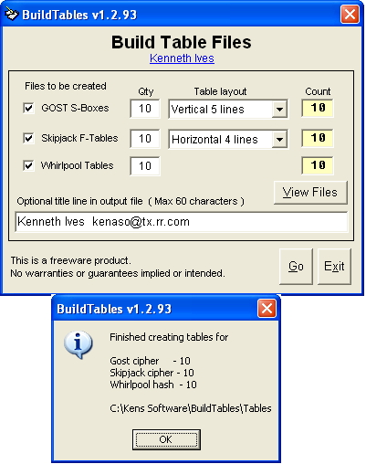



## Build table files  15\-Jun\-2012

### Description

Build table files that can be used with my kiCrypto demo application posted on PSC. These tables can be used with GOST, Skipjack cipher algorithms and Whirlpool hash algorithm for that added security.

----

15-Jun-2012 Updated documentation and support modules.
 
### More Info
 

             |
---                |---
**Submitted On**   |2012-06-14 18:38:02
**By**             |[Kenaso](https://github.com/Planet-Source-Code/PSCIndex/blob/master/ByAuthor/kenaso.md)
**Level**          |Intermediate
**User Rating**    |5.0 (10 globes from 2 users)
**Compatibility**  |VB 6\.0
**Category**       |[Miscellaneous](https://github.com/Planet-Source-Code/PSCIndex/blob/master/ByCategory/miscellaneous__1-1.md)
**World**          |[Visual Basic](https://github.com/Planet-Source-Code/PSCIndex/blob/master/ByWorld/visual-basic.md)
**Archive File**   |[Build\_tabl2224976152012\.zip](https://github.com/Planet-Source-Code/kenaso-build-table-files-15-jun-2012__1-73480/archive/master.zip)

